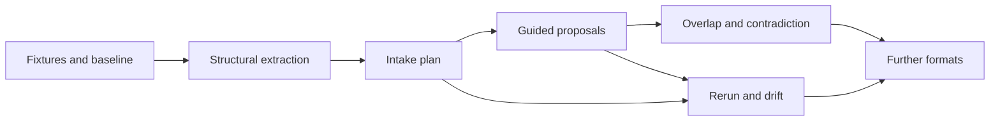

# Outcome

A user with a folder of documents should be able to turn it into a reviewed OKF bundle without leaving Studio, and to rerun that work when the documents change. Every proposed claim stays anchored to its source span, every exclusion is visible, overlap and contradiction between sources become review material rather than silent merges, and nothing reaches disk outside the existing staged review boundary.

This changes the product's opening sentence. Today Studio's loop starts where a bundle exists; intake starts it at the pile of documents most teams actually have. The demand evidence, ecosystem practice, and measured failures of the current path are in [Document Intake Research](../reference/document-intake-research.md); the feature contract is [Document Intake](../features/document-intake.md).

# Baseline before implementation

Recorded 2026-08-29 from the two-PDF dogfood, so the before state cannot be lost:

- The only corpus path is per-thread attachment. A 21-page research PDF reaches the agent as a per-page text dump in which a legal footer repeats 21 times, roughly 30 percent of the characters are disclosure boilerplate, 13 figures collapse to unmarked number soup, and footnotes carrying source URLs and observation dates are orphaned from the claims they support.
- Extraction has no quality diagnostics: glyph-spacing corruption repeated 51 times across one real source arrives unmarked.
- No mapping from sources to proposed concepts persists. Rerunning intake after a source changes means starting over.
- Overlapping sources have no overlap or contradiction surface. A factual error present in one professionally produced source would merge silently.

# Delivery rules

- **Extraction stays deterministic, offline, and bounded.** Structural extraction runs in the existing helper with the existing size, page, and timeout limits. No model participates in extraction.
- **The plan is not authority.** A persisted intake plan never writes, schedules, or grants. Running it requires the same explicit actions as any thread work.
- **Writes stay reviewed.** Proposals use the existing staging, isolated validation, hunk review, atomic Apply, and restore. Intake adds no second write path.
- **Gaps over guesses.** Unrecoverable content becomes a named gap. No OCR, no invented text, no silent skips.
- **Per-source claims.** Merging across sources is a reviewed decision, never an extraction default.
- **Measure with foreign fixtures.** Completion is judged against the CC-BY corpus and synthetic hostile fixtures, not against clean documents.
- **One format at a time.** PDF ships first because its failure shapes are measured. Each further format is its own bounded adapter decision with its own threat model.

# Packages

| Package | Value | Deliverables | Completion gate |
| --- | --- | --- | --- |
| **DI0 Fixture corpus and baseline** | Regressions are measurable before any behavior changes. | Reduced CC-BY excerpts of the IOHK paper with attribution; synthetic fixtures reproducing the shapes the licensed source cannot enter as (repeated footers, number rails, figure captions, footnote-URL-date lines, disclosure tails, glyph-spacing damage); a frozen record of today's per-page output for each. | Fixtures are deterministic, network-free, and run in the pure `okf-core` or helper test lane. The baseline record matches the measured dogfood. |
| **DI1 Structural extraction** | An agent reads a document's structure instead of a page dump. | Body/furniture classification, heading tree, footnote binding, figure and table gaps with captions, page-and-line locators on every item, and quality diagnostics with stable codes, all additive on the adapter receipt. | On the fixture corpus: furniture volume is classified not deleted, all numbered footnotes bind with URL and stated date, every figure is a named gap, damage diagnostics fire on the damaged fixture and stay silent on clean prose. Existing single-attachment behavior is unchanged when the structural layer is absent. |
| **DI2 The intake plan** | The source-to-concept mapping becomes an inspectable object before any agent runs. | Deterministic plan computation in Rust from structural evidence: proposed split points, titles, exclusion list with reasons, evidence inventory, gap list; plan persistence with per-source refresh fingerprints; plan rendering as structured agent work; user adjustment of split points and exclusions. | The same sources produce byte-identical plans. A plan renders with no agent connected and no model cost. Nothing can run, write, or fetch from the plan surface. |
| **DI3 Guided intake proposals** | A corpus becomes a staged bundle proposal with claims anchored to source spans. | An intake task that hands an agent one plan slice at a time with its structural evidence; proposed concepts carrying `io.okf.evidence` records with span locators; footnote-derived source records marked unverified; source-anchored, uncertainty-first review ordering feeding the existing staged boundary. | Every claim in an applied concept traces to a span in the fixture corpus. Boilerplate and furniture do not appear in any proposed concept. Validation, hunk review, Apply, and restore behave identically to existing authoring. |
| **DI4 Overlap and contradiction** | Disagreeing sources become review material instead of silent merges. | Same-topic detection across per-source claims; conflict findings carrying both positions, sources, and observation dates in the `io.okf.reliability` vocabulary; reviewed resolution into a statement or a recorded contradiction. | The seeded factual-error fixture surfaces as a conflict, never as a merged claim. Freshness disagreements carry effective times. An unresolved contradiction survives Apply as valid bundle content. |
| **DI5 Rerun and drift** | Changed sources become named, bounded repair work. | Rerun against saved plans using refresh fingerprints; an impact report naming which concepts changed spans feed; staged difference proposals; routine-surfaced drift notices through the existing attention inbox. | An edited fixture source produces an impact report naming exactly the affected concepts and nothing else. Rerun without changes stages nothing. No rerun happens without an explicit action. |
| **DI6 Further formats** | The on-ramp widens beyond PDF without widening the threat surface. | One additional format adapter (candidate: DOCX) behind the same structural contract, decided by demand evidence at the time. | The new format meets every DI1 gate on its own fixture corpus. The decision, including a rejection, is recorded here with its reasons. |

# Cross-package completion gate

A package is complete only when the user job and failure states are documented before production wiring, the Rust-owned filesystem and grant boundaries remain explicit, fixtures cover the behavior at the cheapest reliable layer, the user-facing behavior ships in code, this bundle, and the product site together, and the bundle validator and CI lanes pass. The [OKF Ecosystem Response](okf-ecosystem-response-roadmap.md) gate list applies unchanged.

# Non-goals

- No extraction service, hosted API, or cloud pipeline. Intake is local work on explicitly selected files.
- No OCR in this roadmap. Image-only content stays a named gap until OCR earns its own bounded decision.
- No template or deliverable generation. Intake produces knowledge, not output documents; projections already cover reviewed sharing.
- No vertical schemas. Intake must never assume invoices, contracts, or any fixed domain, matching the product-wide rule against assuming `type` values.

# Implementation record

No package has shipped. Entries land here as work completes, following the house record format.
